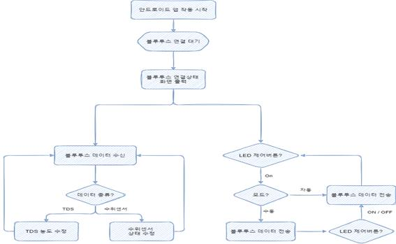
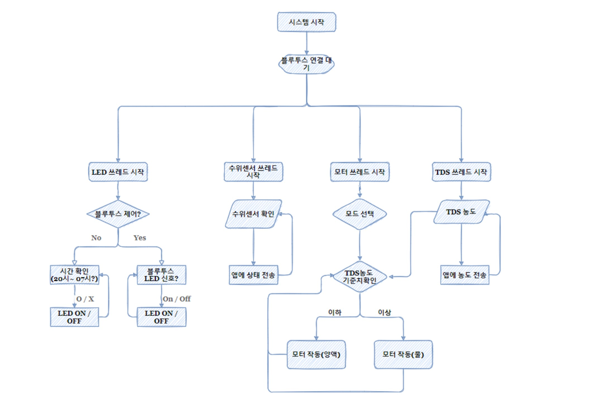
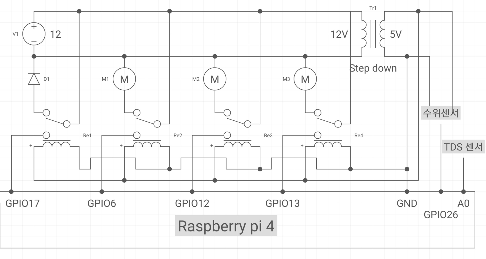
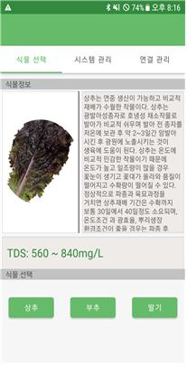
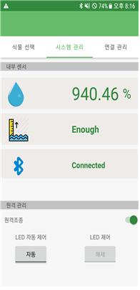
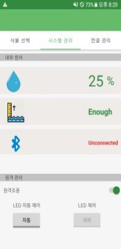
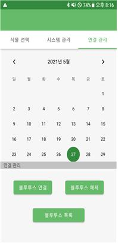
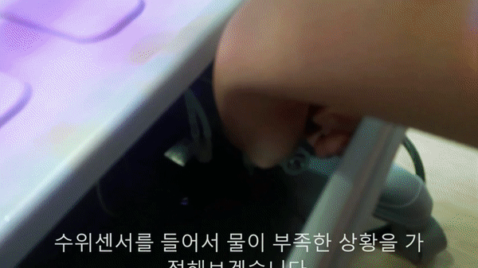

# 자동 수경재배 프로그램

## 개요

## 프로젝트 구조

#### 1. 플로우 차트

- 안드로이드 App
  
- 라즈베리파이
  

#### 2. 회로 구성

## 스크린샷

#### 1. 프로그램 화면

   

#### 2. 프로그램 영상

1. 블루투스 연결
   
   

 

2. 수위센서 감지
   

 

3. TDS 농도 센서 감지에 의한 양액농도 증가 및 감소를 위한 모터 동작
    
